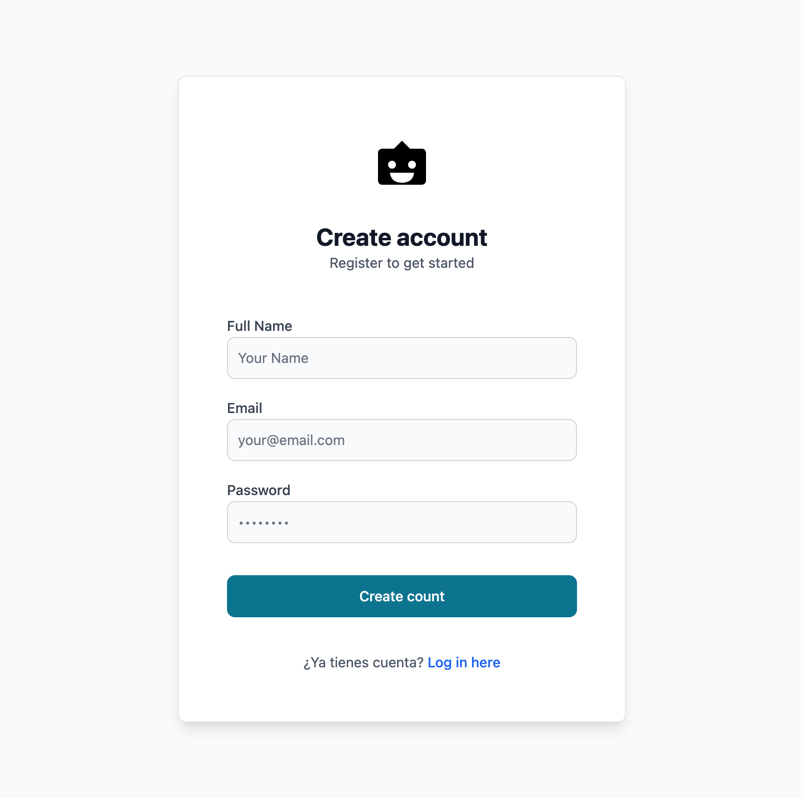
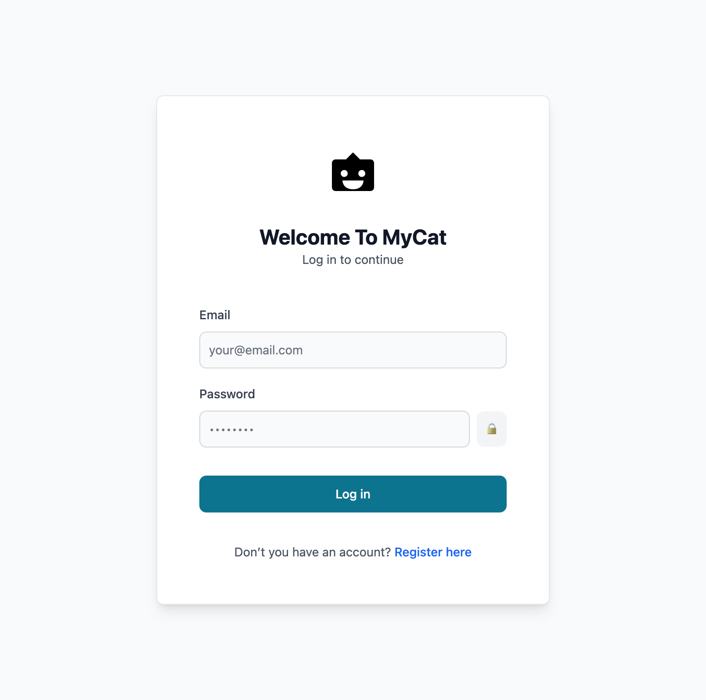
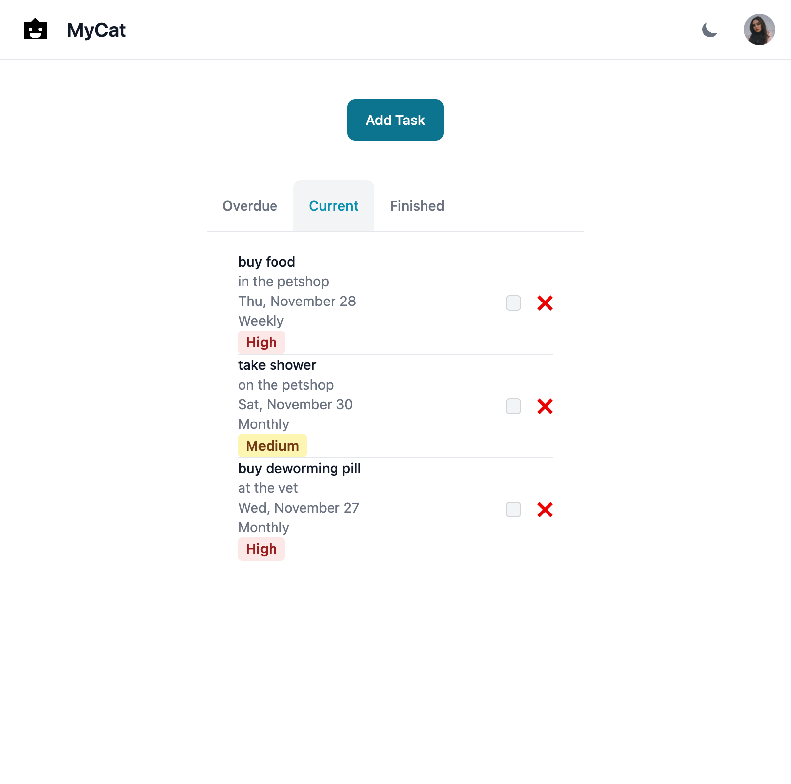

# Cat App 🐱

## Descripción
Cat App es una aplicación diseñada para ayudar a los dueños de gatos a gestionar y cuidar a sus amigos felinos. La aplicación incluye características esenciales como perfiles de gatos y listas de tareas.





.png)

.png)




.png)


## Requisitos Previos 📋

Antes de comenzar, asegúrate de tener instalado:

- Node.js (versión 18 o superior)
- npm (normalmente viene con Node.js)
- MongoDB (instalado y ejecutándose localmente)

## Estructura del Proyecto 🏗️

El proyecto está dividido en tres módulos principales:

```
catapp/
├── api/      # Backend - Servidor Express/TypeScript
├── app/      # Frontend - Aplicación React
└── com/      # Utilidades compartidas
```

## Guía de Instalación 🚀

### 1. Configuración Inicial

Primero, clona el repositorio y navega al directorio del proyecto:

```bash
git clone [URL_DEL_REPOSITORIO]
cd catapp
```

### 2. Instalación del Módulo Común (com)

```bash
cd com
npm install
```

### 3. Configuración del Backend (api)

```bash
cd ../api

# Instalar dependencias
npm install

# Crear archivo .env con las siguientes variables:
# PORT=3000
# MONGODB_URL=mongodb://localhost:27017/catapp
# JWT_SECRET=tu_secreto_aqui

# Poblar la base de datos (opcional)
npm run populate
```

### 4. Configuración del Frontend (app)

```bash
cd ../app

# Instalar dependencias
npm install

# Crear archivo .env con:
# VITE_API_URL=http://localhost:3000
```

## Ejecutar el Proyecto ▶️

### 1. Iniciar el Backend

En el directorio `/api`:
```bash
npm run dev
```
El servidor se iniciará en `http://localhost:3000`

### 2. Iniciar el Frontend

En el directorio `/app`:
```bash
npm run dev
```
La aplicación estará disponible en `http://localhost:5173`

## Características Principales 🌟

### Gestión de Gatos
- Añadir gatos con detalles básicos (nombre, color, raza, fecha de nacimiento)
- Buscar gatos
- Editar información de gatos
- Eliminar gatos
- Listar todos los gatos

### Gestión de Tareas
- Crear tareas relacionadas con el cuidado de los gatos
- Establecer periodicidad (diaria, semanal, mensual, anual)
- Marcar tareas como completadas
- Eliminar tareas
- Ver lista de tareas pendientes y completadas

## Tecnologías Utilizadas 💻

### Backend
- TypeScript
- Express.js
- Node.js
- Mongoose
- JWT para autenticación

### Frontend
- React
- Vite
- Tailwind CSS
- Flowbite React

## Modelo de Datos 📊

### Usuario
- id (objectId, required)
- name (string, required)
- email (string, required)
- password (string, required)

### Gato
- id (objectId, required)
- name (string, required)
- color (string, required)
- breed (string, required)
- birthdate (Date, required)
- avatar (string, optional)
- description (string, optional)
- user (objectId, required, User.id)

### Tarea
- id (objectId, required)
- title (string, required)
- description (string, required)
- priority (string, required)
- completed (boolean, required, default false)
- concurrency (none, daily, weekly, monthly, yearly)
- cat (objectId, required, Cat.id)

## Scripts Disponibles 📜

### Backend (directorio /api)
- `npm run dev`: Inicia el servidor en modo desarrollo
- `npm start`: Inicia el servidor
- `npm test`: Ejecuta las pruebas
- `npm run populate`: Puebla la base de datos con datos de ejemplo

### Frontend (directorio /app)
- `npm run dev`: Inicia el servidor de desarrollo
- `npm run build`: Construye la aplicación para producción
- `npm run preview`: Vista previa de la versión de producción
